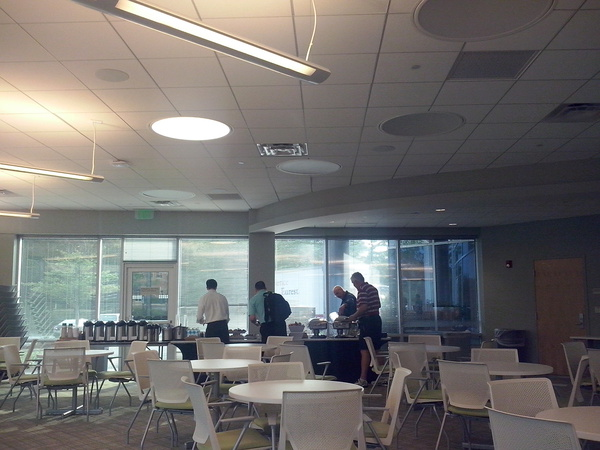
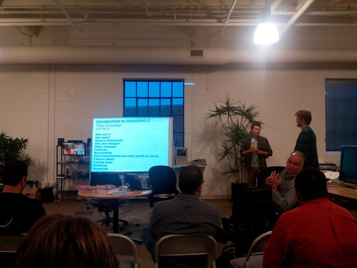
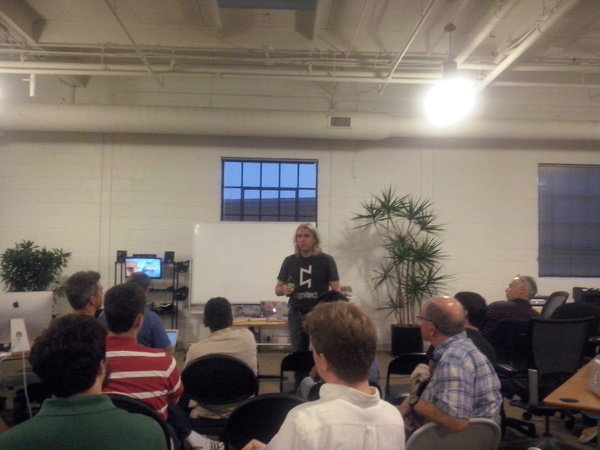
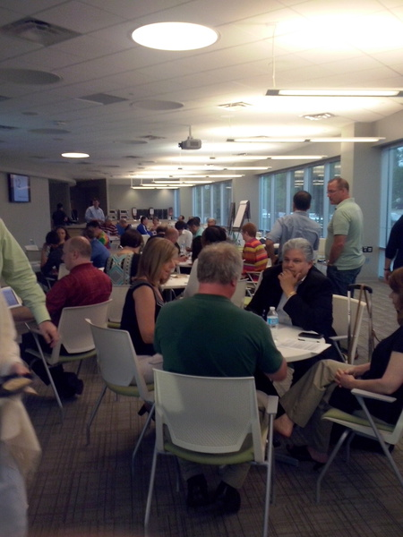
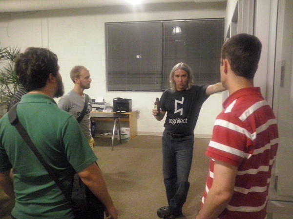
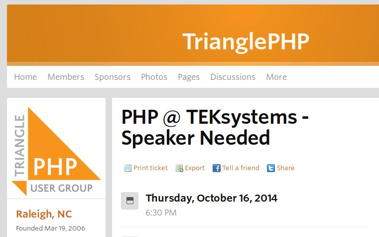

---
# Meetups
## [Adolfo Neto](http://about.me/adolfont)

> Visiting Professor at [Realsearch](http://www.realsearchgroup.com/realsearch/) - North Carolina State University

> Assistant Professor at Federal University of Technology, Paraná

> October 1st, 2014

---

# Meetup

Clarifying the terms:

- *Meetup Group* (User Group)
- *Meetups*: offline meetings
- [Meetup.com](Meetup.com)

---

# First some pictures...

---

### Before

Some meetups offer meals.

Most of the time it is pizza. Not in this case.

---

### Before

There is some time for talking (networking?) before the start of the talk.

---

### During 

During the talk, everybody pays attention.

---

### During

Some talks might include some activity.

---

### After

After the talk, time for some mingling (networking).

---

There are Meetup groups for several different activities ([running](http://www.meetup.com/ncroadrunners/), [cooking](http://www.meetup.com/Raleigh-Cooks/), [playing the piano](http://www.meetup.com/Relax-and-Play-in-the-Triangle/), [learning natural languages](http://www.meetup.com/raleigh-portuguese/), [paleo lifestyle](http://www.meetup.com/Paleo-in-Raleigh/)).

I will concentrate on Meetups related to software development.

Some of them are more related to programming. Others are related to software development process and management, DevOps, etc.

>> Not a new idea? [Users' Group](http://en.wikipedia.org/wiki/Users%27_group)?

---

### Examples of Meetup Groups related to Software Development
### in the [RTP](http://www.rtp.org/) Area*

- [Agile Leadership Network - Raleigh/Durham Area Chapter](http://www.meetup.com/RTP-ALN-Chapter/)
- [Agile Lunches](http://www.meetup.com/Agile-Lunches/)
- [Agile RTP (ARTp)](http://www.meetup.com/agileRTP/)
- [Triangle .NET User Group](http://www.meetup.com/TRINUG/)
- [TriDroid - NC Triangle Android Meetup](http://www.meetup.com/TriDroid/)
- [Triangle Python Users - triPython](http://www.meetup.com/tripython/)

\* Raleigh, Durham, Cary, Chapel Hill, Morrisville.

---

### Examples of Meetup Groups related to Software Development
### in the RTP Area

- [The Triangle Ruby Brigade (Triangle.rb)](http://www.meetup.com/raleighrb/)
- [Triangle JavaScript](http://www.meetup.com/Triangle-JavaScript/)
- [Triangle Node.js](http://www.meetup.com/triangle-nodejs/)
- [TrianglePHP](http://www.meetup.com/trianglephp/)
- [TriClojure - The Triangle Clojure Users Group](http://www.meetup.com/TriClojure/)
- [Triangle Functional Programming](http://www.meetup.com/Triangle-Functional-Programming/)

---

# Types of Meetups 

The actual "offline" meetings:

- Talks
  - Lightning  Talks
- Hack Sessions
- "Meals" (breakfast, lunch)

I have only been to Talks and Lightning Talks.

--- 

# Talks

## Structure:

- [Optional] Food and Drinks (and Networking)
- Announcements (job offers, job requests, other events, ...) [1-10min]
- Talk [45-120min]
- Q&A after the talk [1-10min]
- [Optional] Giveaways [1-10min]
- [Optional] Additional announcements [1-5 min]
- Time for Networking

> Lightning talks have the same structure, except that instead of one talk, it consists of several 5-10 minute talks.

---

## Location:

Usually: 

- Dining hall, conference room 
- Usually in a company: Quintiles, WebAssign, Cognitec, MetLife, RedHat, Ipreo, ...
- Space for 30-100 participants

## Date and Time

Usually: 

- Monday to Thursday
- Start: 6 to 7PM

---

# Meals

- Agile Coaches Breakfast http://www.meetup.com/RTP-ALN-Chapter/events/199420272/

---

# Hack Sessions

- Hack Night http://www.meetup.com/nscoderrtp/events/209239302/

---

## Observations

- Software developers must "stay informed,maintain relationships, and keep their domain knowledge up to date"
- Professionals go to these Meetups after a day of work. They probably find some value in them.
 - Which is the value?
  - Mostly networking?

  
---

# Hypotheses

- Meetups allow more flexibility regarding time than conference talks
- Meetups allow more Q&A during and after the talk than conference talks
- Meetups promote unexpected learning
- Meetups promote Reflective Practice (later)

---

### Meetup Challenges

- [Finding Speakers](http://www.meetup.com/trianglephp/events/202507862/)
  
- Place

---

### Meetup Challenges

- Place
  - Parking (RedHat)
  - Enough seats (some coworking spaces)
  - Distance (NC State?, Durham?)

--- 

## Variables

Groups:

- Name 
- Members
- Creation date
- Upcoming meetups
- Past meetups
- Group reviews

--- 

## Variables

Talks:

- Group
- Food?
- Giveaways?
- Type: Regular or Lightning
- RSVP Yes on site
- Actual Number of Participants

---

## Variables

Talks:

- Start time
- End time
- Place
- Title
- Speaker(s)
- Day of week

---

# Related work

---

### The Reflective Software Engineer: Reflective Practive

- [IEEE Software 2014] (http://ieeexplore.ieee.org/xpl/articleDetails.jsp?arnumber=6834681) - Dybä, Maiden, Glass - Guest Editors' Introduction
- 26 submissions, 4 articles accepted 
- "The capacity to reflect on past practice is important for continuous learning in software development."

---

###  Coderetreats: Reflective Practice and the Game of Life

- [IEEE Software 2014](http://ieeexplore.ieee.org/xpl/articleDetails.jsp?arnumber=6756713)
- [The Three Questions](http://coderetreat.org/facilitating/structure-of-a-coderetreat)
 - What, if anything, did you learn today?
 - What, if anything, surprised you today?
 - What, if anything, will you do differently in the future?

---

## Reflective Practice

- Definition: the capacity to reflect on action so as to engage in a process of continuous learning (Schön, 1983) 

- "Individuals *learning* from their own *professional experiences* rather than from *formal teaching*"
 - May be the most important source of professional development and improvement
 
- practice-based professional learning

- Schön 1983, Dewey 1933, ..., Marcus Aurelius 
 

--- 

### Software Engineers at the Speed of Light: How Developers Stay Current using Twitter

- [ICSE 2014: Singer, Figueira Filho, Storey](http://dl.acm.org/citation.cfm?id=2568305)
- Qualitative study
- Surveyed 271, interviewed 27 developers active on Github
- Human Factors

--- 

### Software Engineers at the Speed of Light: How Developers Stay Current using Twitter

- "Twitter (...) understanding its use could lead to improved support, and learning more about the reasons for non-adoption could inform the design of improved tools" (abstract)
- "Developers have to stay informed, maintain relationships, and keep their domain knowledge up to date" (introduction)

---

## More Related Work

- Papers on Meetups
- Are there papers on User Groups?
- [Coding Dojos](http://www.codingdojo.org/)
 - [The Theory and Practice of Randori Coding Dojos](http://link.springer.com/chapter/10.1007%2F978-3-319-06862-6_18) - XP2014
- [PO Dojos](http://podojo.com/)
- Security Dojos

